# 🚗 Gerenciador de Estacionamento

Projeto desenvolvido como parte da atividade avaliativa da Universidade Federal Rural de Pernambuco (UFRPE).  
O **Gerenciador de Estacionamento** é uma aplicação simples e intuitiva que ajuda no controle e monitoramento de veículos, voltado para usuários que desejam monitorar o estacionamento de seu estabelecimento.

---

## 📱 Sobre o Projeto

Tem como principal objetivo organizar e gerenciar um estacionamento, coletando dados dos usuários e das vagas

- Registrar informações básicas do veículo/Clente
- Calcular preço do alguel do estacionamento
- Adicionar e visualizar manutenções realizadas
- Controlar abastecimentos e gastos
- Gerar relatórios simples sobre o histórico do carro

---

## Diagrama de Classes

```mermaid
classDiagram
    direction TB
    class Pessoa {
        - nome: String
        - cpf: String
        + Pessoa(nome, cpf)
        + getNome() String
        + setNome(nome) void
        + getCpf() String
        + setCpf(cpf) void
        + toString() String
        + equals(obj) boolean
        + hashCode() int
    }

    class Funcionario {
        - salario: double
        - avaliacao: double
        - tempoAtendimento: String
        + Funcionario(salario, avaliacao, tempoAtendimento, nome, cpf)
        + getSalario() double
        + setSalario(salario) void
        + getAvaliacao() double
        + setAvaliacao(avaliacao) void
        + getTempoAtendimento() String
        + setTempoAtendimento(tempoAtendimento) void
        + toString() String
        + equals(obj) boolean
        + hashCode() int
    }

    class Cliente {
        - veiculos: ArrayList~Veiculo~
        - frequencia: int
        - classificacao: String
        - idade: int
        - adimplente: boolean
        + Cliente(veiculos, nome, cpf, idade)
        + getVeiculos() ArrayList~Veiculo~
        + setVeiculos(veiculos) void
        + getFrequencia() int
        + setFrequencia(frequencia) void
        + getClassificacao() String
        + setClassificacao(classificacao) void
        + getIdade() int
        + setIdade(idade) void
        + isAdimplente() boolean
        + setAdimplente(adimplente) void
        + toString() String
        + equals(obj) boolean
        + hashCode() int
    }

    class Veiculo {
        - marcaModelo: String
        - ano: String
        - placa: String
        - tipo: String
        + Veiculo(marcaModelo, ano, placa, tipo)
        + getMarcaModelo() String
        + setMarcaModelo(marcaModelo) void
        + getAno() String
        + setAno(ano) void
        + getPlaca() String
        + setPlaca(placa) void
        + getTipo() String
        + setTipo(tipo) void
        + toString() String
        + equals(obj) boolean
        + hashCode() int
    }
    class RepositorioFuncionario {
        - ARQUIVO: String
        - funcionarios: ArrayList~Funcionario~
        - instance: RepositorioFuncionario
        - RepositorioFuncionario()
        + getInstance() RepositorioFuncionario
        + adicionar(funcionario) void
        + buscarPorCpf(cpf) Funcionario
        + atualizar(funcionario) void
        + remover(cpf) void
        + listarTodos() ArrayList~Funcionario~
        - salvarDados() void
        - carregarDados() void
    }

    class RepositorioCliente {
        - ARQUIVO: String
        - clientes: ArrayList~Cliente~
        - instance: RepositorioCliente
        - RepositorioCliente()
        + getInstance() RepositorioCliente
        + adicionar(cliente) void
        + buscarPorCpf(cpf) Cliente
        + atualizar(cliente) void
        + remover(cpf) void
        + listarTodos() ArrayList~Cliente~
        - salvarDados() void
        - carregarDados() void
    }

    class RepositorioVeiculo {
        - ARQUIVO: String
        - veiculos: ArrayList~Veiculo~
        - instance: RepositorioVeiculo
        - RepositorioVeiculo()
        + getInstance() RepositorioVeiculo
        + adicionar(veiculo) void
        + buscarPorPlaca(placa) Veiculo
        + atualizar(veiculo) void
        + remover(placa) void
        + listarTodos() ArrayList~Veiculo~
        - salvarDados() void
        - carregarDados() void
    }
    class JanelaPrincipal {
        + JanelaPrincipal()
        - inicializarComponentes() void
        - criarPainelCabecalho() JPanel
        - criarPainelBotoes() JPanel
        - criarBotao(texto, icone, descricao) JButton
        - configurarIcone() void
        - criarIconePersonalizado() void
        - criarLogoImagem() JLabel
    }

    class JanelaCrudCliente {
        - repositorio: RepositorioCliente
        - modeloTabela: DefaultTableModel
        - tabela: JTable
        - txtNome: JTextField
        - txtCpf: JTextField
        - txtIdade: JTextField
        - chkAdimplente: JCheckBox
        - cmbClassificacao: JComboBox~String~
        - spnFrequencia: JSpinner
        + JanelaCrudCliente()
        - inicializarComponentes() void
        - criarPainelFormulario() JPanel
        - criarPainelTabela() JPanel
        - criarPainelBotoes() JPanel
        - adicionarCliente() void
        - atualizarCliente() void
        - removerCliente() void
        - carregarClienteSelecionado() void
        - validarCampos() boolean
        - limparCampos() void
        - carregarDados() void
    }

    class JanelaCrudFuncionario {
        - repositorio: RepositorioFuncionario
        - modeloTabela: DefaultTableModel
        - tabela: JTable
        - txtNome: JTextField
        - txtCpf: JTextField
        - txtSalario: JTextField
        - txtTempoAtendimento: JTextField
        - spnAvaliacao: JSpinner
        + JanelaCrudFuncionario()
        - inicializarComponentes() void
        - criarPainelFormulario() JPanel
        - criarPainelTabela() JPanel
        - criarPainelBotoes() JPanel
        - adicionarFuncionario() void
        - atualizarFuncionario() void
        - removerFuncionario() void
        - carregarFuncionarioSelecionado() void
        - validarCampos() boolean
        - limparCampos() void
        - carregarDados() void
    }

    class JanelaCrudVeiculo {
        - repositorio: RepositorioVeiculo
        - modeloTabela: DefaultTableModel
        - tabela: JTable
        - txtMarcaModelo: JTextField
        - txtAno: JTextField
        - txtPlaca: JTextField
        - cmbTipo: JComboBox~String~
        + JanelaCrudVeiculo()
        - inicializarComponentes() void
        - criarPainelFormulario() JPanel
        - criarPainelTabela() JPanel
        - criarPainelBotoes() JPanel
        - adicionarVeiculo() void
        - atualizarVeiculo() void
        - removerVeiculo() void
        - carregarVeiculoSelecionado() void
        - validarCampos() boolean
        - limparCampos() void
        - carregarDados() void
    }

    class Main {
        + main(args) void
    }
    Pessoa <|-- Cliente
    Pessoa <|-- Funcionario
    Cliente "1" *-- "0..*" Veiculo : possui
    RepositorioCliente --> Cliente : gerencia
    RepositorioFuncionario --> Funcionario : gerencia
    RepositorioVeiculo --> Veiculo : gerencia
    
    JanelaCrudCliente --> RepositorioCliente : usa
    JanelaCrudFuncionario --> RepositorioFuncionario : usa
    JanelaCrudVeiculo --> RepositorioVeiculo : usa
    
    JanelaPrincipal --> JanelaCrudCliente : cria
    JanelaPrincipal --> JanelaCrudFuncionario : cria
    JanelaPrincipal --> JanelaCrudVeiculo : cria
    
    Main --> JanelaPrincipal : inicia
```

## 👥 Equipe de Desenvolvimento
[Carlos Eduardo](https://github.com/CarlosDPaula01)

[Ewerton José](https://github.com/Ewerton-Jose)

[Júlio Lucena](https://github.com/Luceena)

[Otoniel Júnior](https://github.com/otonielnn)